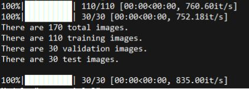
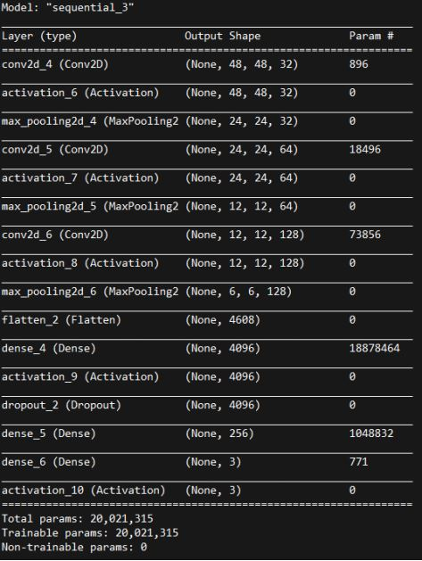
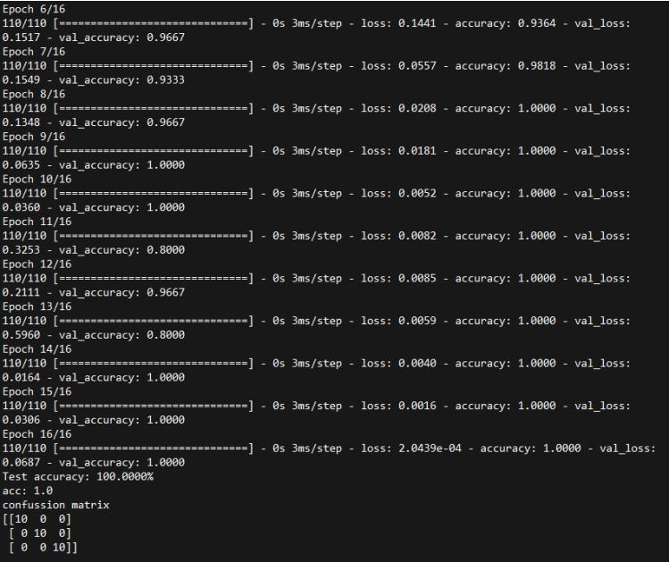

## CNN Object Detection

Object detection system between anchor, airplane and accordion using CNN.

CNN kullanarak çapa, uçak ve akordeon arasında nesne tespit sistemi.

  

There are 170 photos total.

Toplam 170 fotoğraf var.

  

You can see the model that I setup.

Kurduğum modeli görebilirsiniz.

  

I got 100% accuracy after like 25-30 try.

25-30 denemeden sonra% 100 doğruluk elde ettim.
